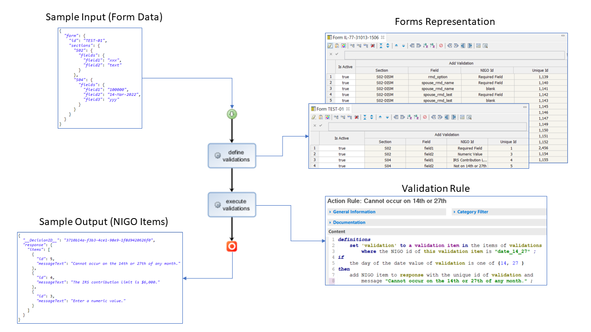
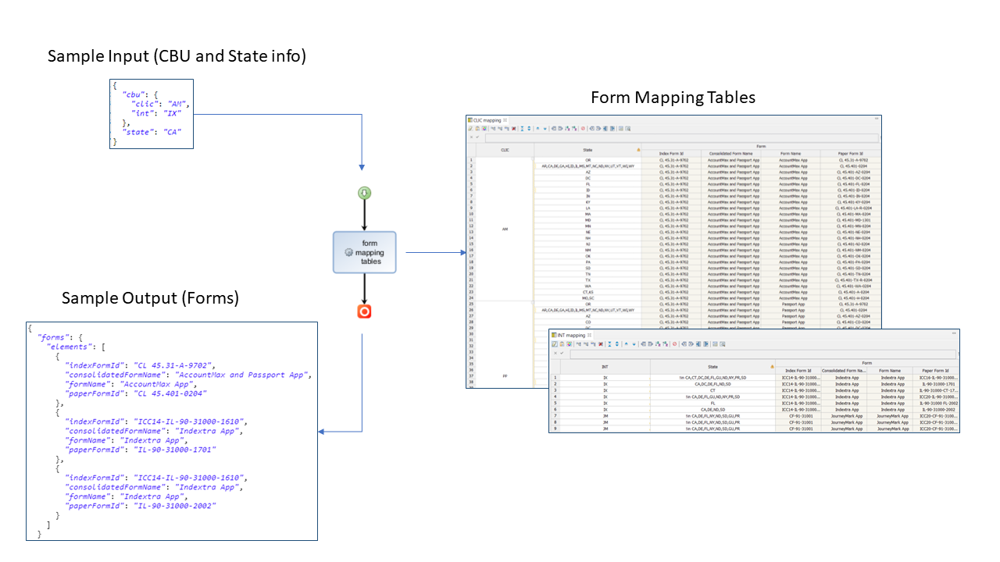

# Western &amp; Southern: Decision Management

## NIGO Validations
The goal of this business decision is to apply a set of validations on the field values of a form and return a collection of issues indicating that the form is not in good order (NIGO).

The source for the rules is provided in [this spreadsheet](../docs/NigoMessages.xlsx).

The ODM design splits the decision in 2 steps:

- The first step creates a representation of the validations that need to happen for a given form. Each form is represented by one decision table. When a form is given as input of the decision service, the corresponding table is selected and executed, collecting all the required validation in a list that is passed to the second step.
- The second steps executes the validations prescribed by the first step. Each type of validation (e.g *is the field numeric?* or *is the amount above the IRS contribution limit?*) is implemented as an individual rule. Each rule is looking for a validation item in the list created in step 1 and when fired (i.e. a NIGO issue has been detected), adds a message to the output.

The design is illustrated on the figure below:

## Forms Mapping

Given some configuration parameters and the state of origination, the Forms Mapping decision gathers the list of forms that need to be prepared. The ODM decision uses a single step in which all the form tables are executed, and the matching forms are collected in the response of the decision service.

The source for the decision tables is provided in [this spreadsheet](../docs/FormsMapping.xlsx).

The design is illustrated on the figure below:

